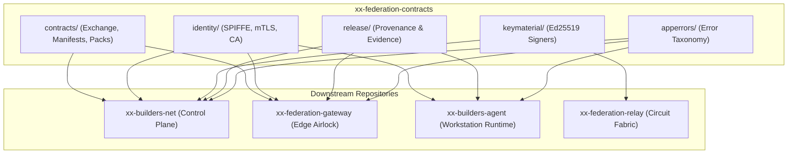

# `xx-federation-contracts`

[](https://pkg.go.dev/github.com/b2bautopilot/xx-federation-contracts)
[](https://goreportcard.com/report/github.com/b2bautopilot/xx-federation-contracts)
[](LICENSE)

> **Sovereign B2B Federation Contracts, Schemas, Cryptographic Key Material, and Identity Primitives.**

`xx-federation-contracts` is the foundational, zero-trust contracts and primitives Go module (`github.com/b2bautopilot/xx-federation-contracts`) for the **B2B Autopilot / Builders Net** sovereign federation ecosystem. It defines the formal inter-enterprise API surface, cryptographic manifest verification, SPIFFE/mTLS component identities, business contract packs (e.g. Order-to-Cash), release provenance, and universal application error handling.

Per **ADR 0009 / ADR 0010**, this repository is self-contained and decoupled from internal control plane database state and container execution engines, allowing enterprise partners and federation components (`xx-builders-net`, `xx-federation-gateway`, `xx-builders-agent`, `xx-mesh-net`) to consume signed contracts and identity specifications independently.

---

## Architecture & Topology



---

## Package Overview

| Package | Import Path | Responsibility |
|---|---|---|
| **`contracts`** | `github.com/b2bautopilot/xx-federation-contracts/contracts/*` | Inter-enterprise gateway exchange protocol, manifest signing, service catalogs, and business packs. |
| **`identity`** | `github.com/b2bautopilot/xx-federation-contracts/identity` | SPIFFE URI parsing, mTLS gRPC transport credentials, X.509 CA generation, and CSR verification. |
| **`keymaterial`** | `github.com/b2bautopilot/xx-federation-contracts/keymaterial` | Ed25519 audit signing, SSH CA providers, short-TTL fabric membership and service access signing keys. |
| **`release`** | `github.com/b2bautopilot/xx-federation-contracts/release` | Build provenance manifests, acceptance test records, and tamper-evident production release evidence. |
| **`apperrors`** | `github.com/b2bautopilot/xx-federation-contracts/apperrors` | Unified application error codes, layer annotations, and fail-closed error wrappers. |
| **`gatewayregistration`** | `github.com/b2bautopilot/xx-federation-contracts/gatewayregistration` | relay-mesh-registration.v0 envelopes, bootstrap intents, local-control authorization, JCS canonicalisation. |
| **`gatewaycert`** | `github.com/b2bautopilot/xx-federation-contracts/gatewaycert` | Certificate planes, SPIFFE namespace builders, plane verification, provider issue/rotate/revoke contract. |
| **`gatewaypool`** | `github.com/b2bautopilot/xx-federation-contracts/gatewaypool` | Gateway pool coordinator lease vocabulary and liveness rule. |

### 1. `contracts`
The inter-enterprise protocol surface:
- **`contractmanifest`**: Canonical Ed25519-signed manifest documents, SHA-256 digest calculations, keyring verification, and multi-version catalog bindings.
- **`contractapproval`**: Two-party signature records, governance approvals, tenant policy scoping, and policy grant verification.
- **`contractpacks/ordertocash`**: Canonical Order-to-Cash v1 business contract pack (`order_to_cash.v1`) covering:
  - `request_for_quote` & `submit_quote`
  - `submit_purchase_order` & `confirm_order`
  - `update_shipment_status`
  - `issue_invoice` & `update_payment_status`
- **`exchange`**: Inter-enterprise gateway exchange protocol (`builders.federation.gateway_exchange.v1`), discovery queries, data channel preflight checks, and session scoping.
- **`transport`**: Gateway-to-gateway transport identity, policy, negotiation and AES-GCM relay payload sealing.
- **`relaywire`**: Payload-blind relay rendezvous control frames (length-prefixed JSON).
- **`federationstate`**: Federation state vocabularies and usability predicates shared by control and gateway.
- **`orgregistry`**: Deterministic receiver rendezvous ids, blind presence-ref derivation and receiver intake decisions.
- **`facade`**: Facade vocabulary — outbound exchange states, failure classes, binding matchers, dev gateway headers.
- **`servicecatalog`**: Partner-visible service registrations, endpoint routing metadata, and schema validations.
- **`cmd/manifestsign`**: Authority CLI tool for minting and signing canonical manifest keyrings.

### 2. `identity`
Zero-trust component identity and mTLS abstractions under the `builders-net` trust domain:
- **SPIFFE Identifiers**: Deterministic URI schemes for workloads (`spiffe://builders-net/...`), runtimes (`x-builders-agent://...`), and gateways (`x-builders-gateway://...`).
- **Mutual TLS Helpers**: `ServerTransportCredentials`, `ClientTransportCredentials`, and `ServerTLSOnlyCredentials` configuring strict client certificate verification and CRL checks.
- **Certificate Authority & CSR Operations**: Ephemeral/dev-local and Vault/SPIRE certificate authority generators and CSR signers.

### 3. `keymaterial`
Cryptographic key material providers:
- **Audit Signing Keys**: Ed25519 signing keys for immutable ledger audit records.
- **SSH CA Keys**: Short-lived certificate signing for secure operator and container debug access.
- **Fabric Membership Keys**: Dedicated Ed25519 signers for libp2p network admission tokens (isolated from CA and audit keys).
- **Service Access Keys**: Short-TTL capability signers for exposed enterprise microservices (`fed-svc`).

### 4. `release`
Standardized build provenance and compliance evidence:
- **Release Manifest**: Embeds Go module versions, compiler flags, and dependency trees without leaking secrets (`release.BuildManifest`).
- **Acceptance Records**: Verifies security invariants (e.g. gateway facade restriction, no private IP leakage).
- **Production Evidence**: Retained signed backend evidence records for audit compliance.

### 5. `apperrors`
Cross-cutting application error taxonomy:
- Standardized error codes: `auth.unauthorized`, `config.invalid`, `policy.denied`, `control.runtime_unavailable`, `storage.unavailable`, etc.
- Safe unwrapping and layer tracking.

---

## Installation

Add the module to your Go project:

```bash
go get github.com/b2bautopilot/xx-federation-contracts@latest
```

Ensure your Go version is `1.26` or newer.

---

## Quickstart & Usage Examples

### 1. Verifying a Signed Contract Manifest

```go
package main

import (
	"crypto/ed25519"
	"fmt"
	"log"

	"github.com/b2bautopilot/xx-federation-contracts/contracts/contractmanifest"
)

func main() {
	var pubKey ed25519.PublicKey // Loaded from public keyring
	var signedDoc contractmanifest.SignedDocument

	manifest, err := contractmanifest.Verify(signedDoc, pubKey)
	if err != nil {
		log.Fatalf("Manifest signature verification failed: %v", err)
	}

	fmt.Printf("Verified manifest for tenant: %s, schema: %s\n",
		manifest.TenantID, manifest.SchemaVersion)
}
```

### 2. Extracting SPIFFE Identity from gRPC Context

```go
package main

import (
	"context"
	"fmt"
	"log"

	"github.com/b2bautopilot/xx-federation-contracts/identity"
)

func HandleGatewayRequest(ctx context.Context) error {
	gwIdentity, err := identity.GatewayIdentityFromContext(ctx)
	if err != nil {
		return fmt.Errorf("unauthorized caller: %w", err)
	}

	log.Printf("Authenticated gateway: Tenant=%s, GatewayID=%s, SPIFFE=%s",
		gwIdentity.TenantID, gwIdentity.GatewayID, gwIdentity.SPIFFEID)
	return nil
}
```

### 3. Validating an Order-to-Cash Interaction

```go
package main

import (
	"context"
	"fmt"
	"log"

	"github.com/b2bautopilot/xx-federation-contracts/contracts/contractpacks/ordertocash"
)

func ValidateRFQ(ctx context.Context, payloadJSON []byte) error {
	action := ordertocash.ActionRequestForQuote
	if err := ordertocash.ValidatePayload(action, payloadJSON); err != nil {
		return fmt.Errorf("invalid RFQ payload: %w", err)
	}

	fmt.Println("RFQ payload is conformant with order_to_cash.v1")
	return nil
}
```

### 4. Structured Fail-Closed Errors

```go
package main

import (
	"errors"
	"fmt"

	"github.com/b2bautopilot/xx-federation-contracts/apperrors"
)

func AuthorizeAction(tenantID string) error {
	if tenantID == "" {
		return apperrors.New(apperrors.CodeAuthUnauthorized, "auth", "tenant id required")
	}
	return nil
}
```

---

## Building and Testing

Run the full test suite locally:

```bash
# Build all packages
go build ./...

# Run all unit tests with full race and count verification
go test -count=1 -race ./...
```

---

## Invariants & Design Principles

1. **Zero Business Logic in Transport**: Schemas define data contracts, envelope layouts, and validation rules; they do not dictate storage backends or internal process scheduling.
2. **Deterministic Serialization**: Signatures and digest hashes must operate over byte-identical, canonicalized JSON/Protobuf representations.
3. **Fail-Closed Verification**: Unsigned or unknown capability tokens, expired credentials, and unverified SPIFFE URIs are rejected by default.
4. **Self-Contained Modularity**: `go.mod` contains no local `replace` directives; all inter-module references are clean and versioned.

---

## Documentation

- [AGENTS.md](AGENTS.md) — Comprehensive developer and AI agent onboarding guide and architectural invariants.
- [SPEC-DRIVEN-DEVELOPMENT.md](SPEC-DRIVEN-DEVELOPMENT.md) — Spec-Driven Development handbook, schema evolution rules, and cross-repo propagation guidelines.

---

## License

Apache-2.0. See [LICENSE](LICENSE) for details.
