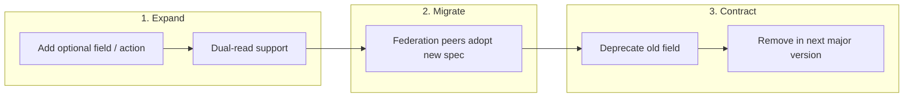
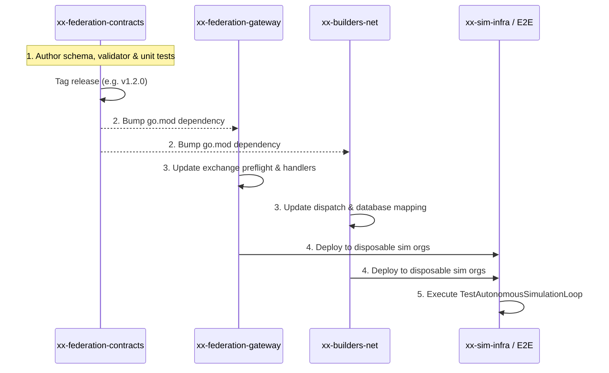

# Spec-Driven Development (SDD) for Federation Contracts

This document outlines the **Spec-Driven Development (SDD)** lifecycle, schema evolution guidelines, and cross-repository propagation rules for `xx-federation-contracts` (`github.com/b2bautopilot/xx-federation-contracts`).

---

## 1. Why Spec-Driven Development Matters

In the B2B Autopilot sovereign federation network:
- Each enterprise operates its own private control plane, gateways, and agent runtimes across disparate cloud providers (GCP, AWS, Azure, On-Prem).
- Deployments are **asynchronous and uncoordinated**: Enterprise A may be running version `v1.1.0` while Enterprise B is on `v1.4.2`.
- There is **no global synchronized downtime** or single shared database.

Under these conditions, data schemas, exchange protocols, and cryptographic manifests must be treated as **formal, immutable contracts**. Breaking wire formats or validation semantics causes immediate federation partition and data corruption.

---

## 2. Core Schema Evolution Principles



### Rule 1: Expand Before Contract (Non-Breaking Changes)
Never modify or remove an existing field in a single step. All schema changes follow the three-phase **Expand-Migrate-Contract** cycle:

1. **Expand**:
   - Add new fields as optional (pointers or omitempty in Go; optional in Protobuf).
   - Ingest logic must accept both old and new representations.
2. **Migrate**:
   - Upstream issuers (control planes, gateways) begin producing the new representation.
   - Downstream verifiers log telemetry confirming adoption across all active federation peers.
3. **Contract**:
   - Mark old fields deprecated in documentation and code comments.
   - Remove deprecated fields only upon a major version boundary (`v2.0.0`) after guaranteed migration across the network.

### Rule 2: Strict Additive Compatibility
- **Never rename or reorder fields**: Wire JSON keys and Protobuf tag numbers are permanent once published.
- **Never change enum semantics**: If enum value `1` represents `STATUS_PENDING`, it must never be repurposed to `STATUS_REVIEW`. Add new enum variants additively.
- **Unknown fields must be preserved or safely ignored**: Deserialization logic must never fail simply because a newer peer sent an unrecognized field.

### Rule 3: Deterministic Canonicalization
Cryptographic signatures (Ed25519) and integrity digests (SHA-256) depend on byte-identical serializations:
- JSON payloads must be formatted with sorted keys and normalized whitespace before hashing.
- Timestamps must always be formatted in RFC3339 UTC (`2026-09-01T12:00:00Z`) or integer milliseconds since Unix epoch (`ExpiresAtMS`).
- Floating point values in financial contracts must be avoided or represented as integer cents / micros (`math.Round`) to prevent precision drift across CPU architectures.

---

## 3. Protobuf & Go Schema Synchronization

When defining or updating contracts in this repository:

1. **Wire Compatibility**:
   Ensure Go struct tags match the exact JSON wire protocol:
   ```go
   type PurchaseOrderPayload struct {
       OrderID     string `json:"order_id"`
       QuoteHash   string `json:"quote_hash"`
       TotalMicros int64  `json:"total_micros"`
       Currency    string `json:"currency"`
       // New field added in v1.1.0 (optional / additive)
       TaxExemptID string `json:"tax_exempt_id,omitempty"`
   }
   ```

2. **Validation Logic**:
   - Separate structural parsing from business validation.
   - Return structured application errors from `apperrors` (`apperrors.CodeCoordInvalidArgument`, `apperrors.CodePolicyDenied`).

3. **Golden Testing & Fuzzing**:
   - Every contract pack must include golden tests validating backward compatibility with previously serialized JSON fixtures.
   - Test deserialization against historical payload snapshots from older releases.

---

## 4. Cross-Repository Dependency Propagation

When a contract change is required:



### Step 1: Spec & Test in `xx-federation-contracts`
- Implement new schemas, action definitions, or cryptographic key helpers.
- Run `go test -count=1 -race ./...` locally.
- Tag and release the new semantic version (e.g. `v1.2.0`).

### Step 2: Update Downstream Repositories
Update `go.mod` in downstream services:
- `xx-federation-gateway`: Implements new exchange actions or contract validation rules.
- `xx-builders-net`: Updates coordination dispatch, database storage, and approval tracking.
- `xx-builders-agent`: Updates MCP tools and workload sandboxing if applicable.

### Step 3: Run End-to-End Simulation Verification
- Execute cross-cloud simulation runs (`scripts/autonomous-cross-cloud-loop.sh` in orchestration environment).
- Verify that mixed-version nodes (`v1.1.0` and `v1.2.0`) successfully exchange contracts, verify manifests, and execute workflows without regression.

---

## 5. Authoring a New Contract Pack (Example)

To add a new domain pack (e.g. `logistics.v1`):

1. **Create Package**:
   Create `contracts/contractpacks/logistics/`.

2. **Define Actions & State Machine**:
   ```go
   package logistics

   const (
       PackSchemaVersion = "logistics.v1"

       ActionCreateShipment   = "logistics.v1.create_shipment"
       ActionUpdateTracking   = "logistics.v1.update_tracking"
       ActionConfirmDelivery  = "logistics.v1.confirm_delivery"
   )
   ```

3. **Implement Payload Validation**:
   ```go
   func ValidatePayload(action string, data []byte) error {
       switch action {
       case ActionCreateShipment:
           var p CreateShipmentPayload
           if err := json.Unmarshal(data, &p); err != nil {
               return apperrors.Wrap(apperrors.CodeCoordInvalidArgument, "logistics", "invalid payload", err)
           }
           if p.ShipmentID == "" || p.DestinationAddress == "" {
               return apperrors.New(apperrors.CodeCoordInvalidArgument, "logistics", "missing required fields")
           }
           return nil
       // handle other actions...
       default:
           return apperrors.New(apperrors.CodeCoordInvalidArgument, "logistics", "unknown action")
       }
   }
   ```

4. **Add Comprehensive Unit Tests**:
   Add `pack_test.go` covering valid payloads, edge cases, missing fields, and JSON canonicalization.
